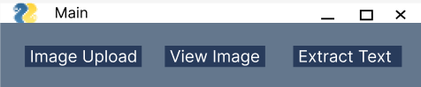
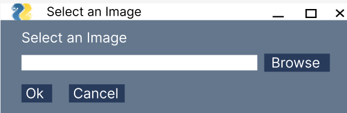
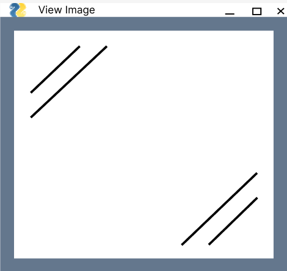
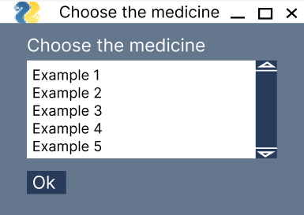
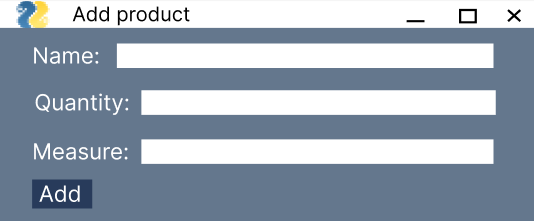
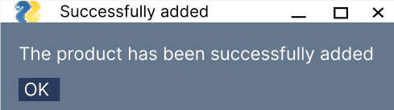

[Readme in english](https://github.com/lucasgleria/Python-deep-learning-image-medicine-recognizer/edit/main/readme.md#deep-learning-project---portfolio)

# Projeto de Deep Learning - Portfólio

## | Objetivo principal

O objetivo central de criar projetos de deep learning para o portfólio é demonstrar minhas habilidades, conhecimentos e experiência como desenvolvedor de softwares para potenciais empregadores, clientes e colegas de trabalho.

Esse portfólio serve como uma maneira eficaz de exibir meu trabalho e destacar-me no mercado de desenvolvimento.

## | O Projeto: lleria medicine recognizer

Neste repositório está o projeto medicine recognizer, desenvolvido apenas por mim.

- Público Alvo: A quem interessar
- Tema do Projeto: Reconhecer imagens de medicamentos e extrair suas informações através de uma GUI
- Disponiblizamos: O script completo

## | O que encontrarei nessa aplicação web?

- Janela _Principal_
  - 4 botões principais:

    - Botão de Upload
    - Botão de Exibição
    - Botão de Extração
    - Botão de Encerrar Programa

    

- Pop-up _Upload_
  - Pop-up de busca de imagem em seus arquivos.

    

- Janela _Exibição_

  - Apenas uma janela que se abre exibindo a imagem selecionada ao selecionar o botão de exibição

    

- Janela _Secundária_

  - Janela de escolha de medicamento, caso a IA tenha reconhecido mais de um medicamento na imagem fornecida
    - Tabela selecionável
    - 1 botão: Ok

      

  - Janela para adicionar os medicamentos ao banco de dados

    - 3 inputs: nome, unidade e medida
    - 1 botão: Adicionar

      > Ps: As informações são preenchidas automaticamente pelo programa

      

- Pop-up _Success_
  - Pop-up de mensagem de sucesso após as operações
    

## | Como fazer funcionar na minha máquina?

Apenas faça o download de todas as importações no seu terminal corretamente.

```terminal
pip install pysimplegui==4.60.5 pytesseract easyocr sqlite3 pillow pyocr
```

### Caso o seu pytesseract não esteja funcionando corretamente pela importação, abaixo há outra solução.

Faça o download do pytesseract no github oficial e faça as configurações adequadas.

Um possível tutorial a seguir: https://www.youtube.com/watch?v=ApzqNRCuBdY siga até o minuto 4:40 para recolher o caminho corretamente.

### Não se esqueça de adicionar o caminho correto ao projeto, adicione essa linha no começo do script:

```python
# Configurando o caminho para o executável do Tesseract-OCR
pytesseract.pytesseract.tesseract_cmd = r'Seu_path_aqui'
```

> Ps: Estou utilizando o python 3.9.9 nesse projeto

## | Tecnologias Utilizadas

**Desenvolvimento de Interface de Usuário**

[](https://figma.com)
[](https://github.com/PySimpleGUI)

**Desenvolvimento da Aplicação**

[](https://python.com/)
[](https://github.com/PySimpleGUI)
[](https://github.com/tesseract-ocr/tesseract)
[](https://github.com/JaidedAI/EasyOCR)

**Desenvolvimento, manipulação e hospedagem do Banco de Dados**

[](https://sqlite.com/)

**Manipulação, controle e hospedagem de dados e versões**

[](https://docs.github.com/)
[](https://git-scm.com/doc)

**Local de Deploy**

--

## | Equipe

- [Lucas Gomes Leria](https://www.linkedin.com/in/lucasleria/) - Desenvolvedor Fullstack

##

# Deep Learning Project - Portfolio

## | Main goal

The main goal of creating deep learning projects for the portfolio is to demonstrate my skills, knowledge and experience as a software developer to potential employers, clients and coworkers.

This portfolio serves as an effective way to showcase my work and stand out in the development market.

## | The Project: lleria medicine recognizer

This repository contains the medicine recognizer project, developed by me alone.

- Target audience: Anyone interested
- Project topic: Recognizing medicine images and extracting their information through a GUI
- Available: The complete script

## | What will I find in this web application?

- _Main_ window

  - 4 main buttons:

    - Upload button
    - Display button
    - Extract button
    - End Program button

    

- _Upload_ pop-up
  - Pop-up to search for images in your files.

    


- _Display_ window

  - Just a window that opens displaying the selected images/image when you select the display button

    

- _Secondary_ Window

  - Drug choice window, if the AI has recognized more than one drug in the images/image provided
    - Selectable table
    - 1 button: Ok

      


  - Window for adding medicines to the database

    - 3 inputs: name, unit and measure
    - 1 button: Add

      > Ps: The information is filled in automatically by the program

      

- Pop-up _Success_
  - Success message pop-up after operations

    

## How do I get it to work in my machine?

Just download all the imports into your terminal correctly.


```terminal
pip install pysimplegui==4.60.5 pytesseract easyocr sqlite3 pillow pyocr
```

### In case your pytesseract is not working correctly via import, below is another solution.

Download pytesseract from the official github and make the appropriate settings.

A possible tutorial follows: https://www.youtube.com/watch?v=ApzqNRCuBdY follow until minute 4:40 to collect the path correctly.

### Don't forget to add the correct path to the project in the begging of the script:

```python
# Setting the path to the Tesseract-OCR executable
pytesseract.pytesseract.tesseract_cmd = r'Your_path_here'
```

> Ps: I'm using python 3.9.9 in this project

## | Technologies Used

**User Interface Development**

[](https://figma.com)
[](https://github.com/PySimpleGUI)

**Application Development**

[](https://python.com/)
[](https://github.com/PySimpleGUI)
[](https://github.com/tesseract-ocr/tesseract)
[](https://github.com/JaidedAI/EasyOCR)

**Database development, manipulation and hosting**

[](https://sqlite.com/)

**Data and version manipulation, control and hosting**

[](https://docs.github.com/)
[](https://git-scm.com/doc)

**Deployment location**

--

## | Team

- [Lucas Gomes Leria](https://www.linkedin.com/in/lucasleria/) - Fullstack Developer
